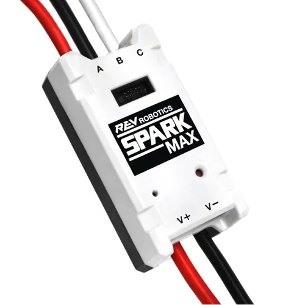
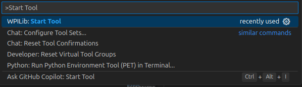
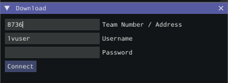
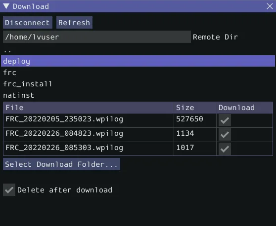
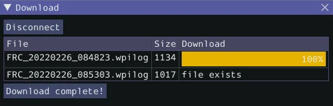

# ✨ Spark Max


<div style="display:flex; gap:20px; align-items:flex-start;">
  <div style="flex:1;">
    <p>This guide is meant to show how to run a SysID routine for a Spark Max controller.</p>
  </div>
  <div style="width:150px;">
    
  </div>
</div>

## ☕ Instantiate sparkmax SysID subsystem
### 1. Import spark max SysID subsystem
Skipping this step and auto importing is faster if your familiar with VS Code.
### 2. Instantiate the sparkMax SysID subsystem
The first argument is the motor ID. The second argument should be true if the motor is brushed and false if it is brushless.
### 3. Set the subsystem to sparkMax
```java
package frc.robot;
... // Other imports
import frc.robot.subsystems.SparkMaxSysId; // Step 1
...
public class Robot extends TimedRobot {
...
  // Step 2
  private final SparkMaxSysId sparkMax = new SparkMaxSysId(<Motor ID>, false);
  ...
  public Robot() {
      // Step 3
      SysIdSubsystem subsystem = sparkMax;
  ...
```

## 🎮 ➕ 🦾 Run the routine
### 1. Deploy the project to the robot
### 2. Enable the robot
### 3. Run sysid routine
Hold up on the D-pad (looks like ➕ on controller) until the motor stops spinning.

## 🪵 📂 Download log files
[wpilib DataLogTool docs](https://docs.wpilib.org/en/stable/docs/software/telemetry/datalog-download.html)

### 1. 🧬 Open DataLogTool
`DataLogTool` is installed by default


However, it can be started as follows:

And select data log tool

### 2. Connect to robot 🤖
Enter the team number of the robot and click `Connect`


You should see something like:


### 3. Download the log file
The log file the routine created should be in /home/lvuser/logs. Select it and click `Select Download Folder...`. Select the folder you want the files to download to (such as Downloads). After the `Download` button appears, click it. You should see something like:


