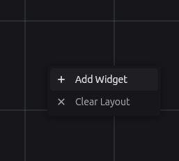
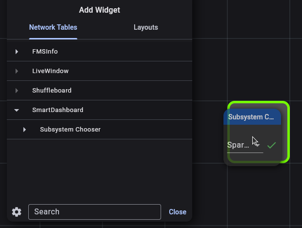
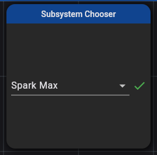
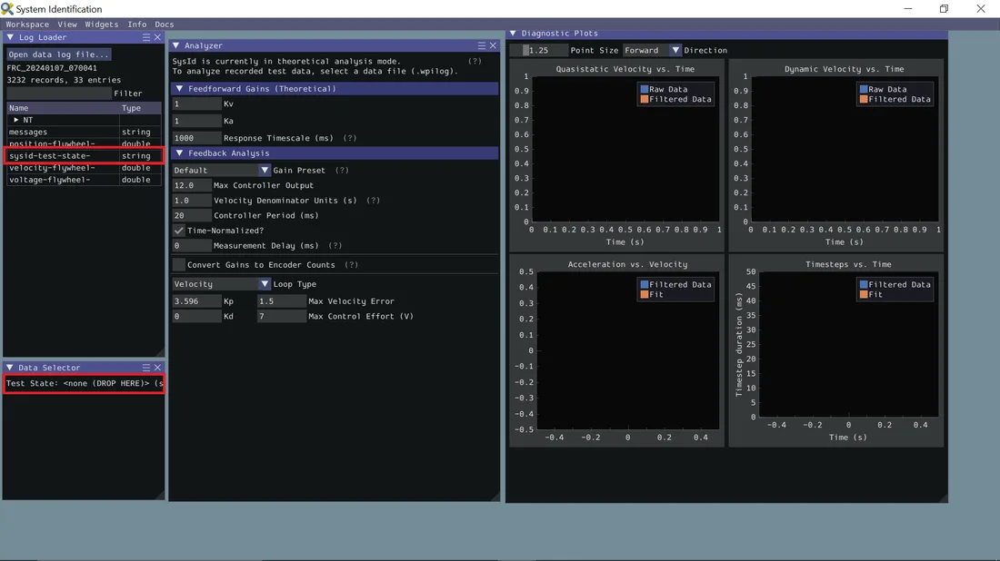
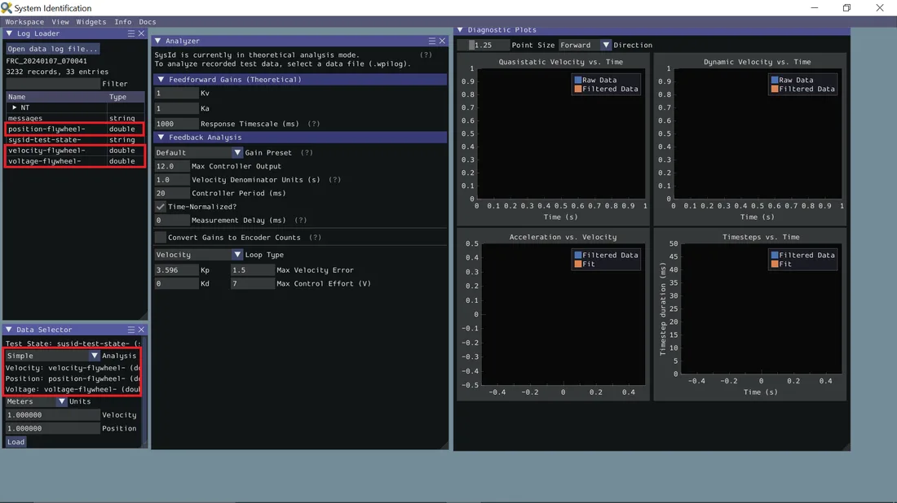

# ✨ Spark Max


This guide is meant to show how to run a SysID routine for a Spark Max controller.


## ☕ Set up Spark Max subsytem
In Constants.java, set the motor id and the motor type. Set motor type to true if brushed and false if brushless. Neos are brushless
```java
public static class SparkMaxContants {
    public static final int motorId = 6;
    public static final boolean brushed = false;
}
```

## 🎮 ➕ 🦾 Run the routine
### 1. Deploy the project to the robot
### 2. Select Spark Max in Elastic
Open `Elastic`, right click on the grid, select `Add Widget`.



Expand `SmartDashboard`, and drag Subsystem Chooser onto the grid. When the robot is enabled, this subsystem will be applied.




### 3. Enable the robot
### 4. Run sysid routine
Hold up on the D-pad (looks like ➕ on controller) until the motor stops spinning.

## 🪵 📂 Download log files
[wpilib DataLogTool docs](https://docs.wpilib.org/en/stable/docs/software/telemetry/datalog-download.html)

### 1. 🧬 Open DataLogTool
`DataLogTool` is installed by default


However, it can be started as follows:


And select data log tool

### 2. 🤖 Connect to robot
Enter the team number of the robot and click `Connect`


You should see something like:


### 3. ⬇️ Download the log file
The log file the routine created should be in /home/lvuser/logs.
Select it and click `Select Download Folder...`.
Select the folder you want the files to download to (such as Downloads).
After the `Download` button appears, click it. You should see something like:


### 4. Convert Log Files to CSV
Open the file downloaded file by clicking `Open File(s)...`.
Select output folder for the CSV file by clicking `Select Output Folder`. Finally, click `Export CSV`.


## 🖥 Compute SysID
[wpilib SysID tool docs](https://docs.wpilib.org/en/stable/docs/software/advanced-controls/system-identification/loading-data.html)

Click `Open data log file...` and select the new CSV file.
Drag `sysid-test-state-SparkMaxSysId` into the `Data Selector` pane's `Test State` slot.

Now the `Data Selector` pane will present `Position`, `Velocity`, and `Voltage` slots. In the `Log Loader` pane, find entries starting with each of those terms and containing `SparkMaxSysId`.





Ensure the correct analysis type has been selected, then click the `Load` button and move on to checking the fit diagnostics in the `Diagnostics` pane.